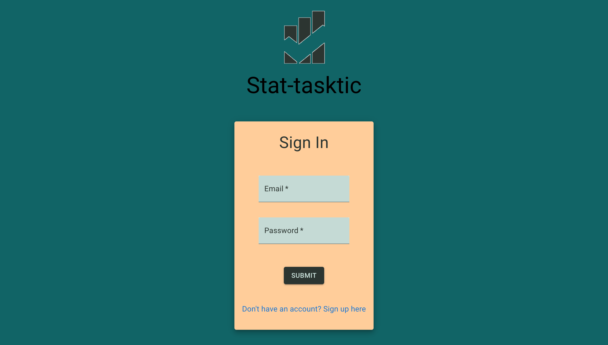

# Stat-Tasktics

A task manager with statistical analysis using a MERN stack.

## Description

This app is a task-tracking app that allows the user to track tasks as well as understand their statistics of completing these tasks.

## Table of Contents

- [Stat-Tasktics](#stat-tasktics)
  - [Description](#description)
  - [Table of Contents](#table-of-contents)
  - [Installation](#installation)
  - [Usage](#usage)
  - [Credits](#credits)
  - [License](#license)
  - [Features](#features)
  - [How to Contribute](#how-to-contribute)
  - [Tests](#tests)
  - [Questions](#questions)

## Installation

N/A

## Usage

Keep track of various tasks and understand performance over time.

<!-- TODO: add link here of working app.  -->

## Credits

Brent Keller: https://github.com/bikeller104
Jacob Aston: https://github.com/Jacob-Aston
Matt Thurn: https://github.com/MattThurn
Ryan Cottle: https://github.com/rtcottle

## License

This project is under the .

## Features

Adding, updating, completing, and removing tasks. Also setting intervals for refresh on task lists.

## How to Contribute

Connect via GitHub here: https://github.com/Jacob-Aston/stats-tasktics

## Tests

Try making an account and adding task lists and tasks. Set the refresh on a list and see how you do at keeping up on your tasks.

## Questions

Reach out to a contributor: https://github.com/Jacob-Aston/stats-tasktics
